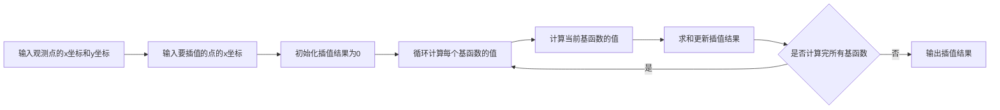
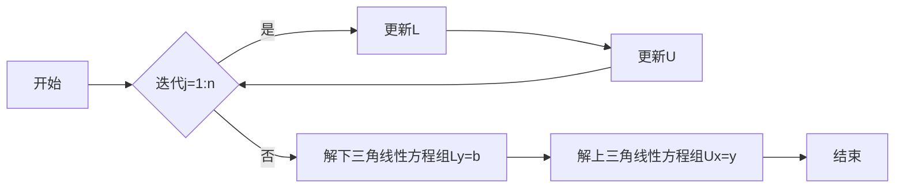
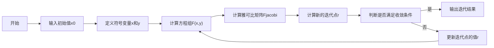
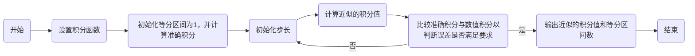
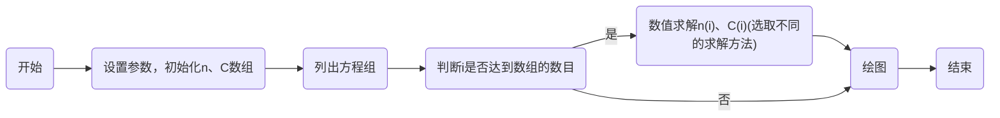
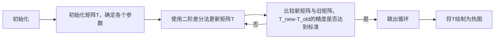

## TP 1

### TP 1-1

#### 离散线性方程

<style>
    body {
        display: flex;
        justify-content: center;
        align-items: center;
        font-size: 24px;
    }
</style>

**牛顿插值**
若有$x_0,x_1\dots x_k$以及$y_0,y_1\dots y_k$，则牛顿插值的公式如下
$P_n(x) = f(x_0) + f(x_0,x_1)(x-x_0) + f(x_0,x_1,x_2)(x-x_0)(x-x_1) + \cdots + f(x_0,x_1,\ldots,x_n)(x-x_0)(x-x_1)\cdots(x-x_{n-1})$
其中

$$
\begin{cases}
f(x_0) = f(x_0) \\
f(x_0,x_1) = \frac{f(x_1) - f(x_0)}{x_1 - x_0} \\
f(x_0,x_1,x_2) = \frac{f(x_1,x_2) - f(x_0,x_1)}{x_2 - x_0} \\
\vdots \\
f(x_0,x_1,\ldots,x_k) = \frac{f(x_1,\ldots,x_k) - f(x_0,\ldots,x_{k-1})}{x_k - x_0}
\end{cases}
$$

**拉格朗日插值**
$L_1(x),L_2(x)\dots L_k(x)$为拉格朗日插值法的基函数，其公式如下

$$
\begin{cases}
L_1(x) = \frac{(x - x_2)(x - x_3)(x - x_4)...(x - x_n)}{(x_1 - x_2)(x_1 - x_3)(x_1 - x_4)...(x_1 - x_n)} \\
L_2(x) = \frac{(x - x_1)(x - x_3)(x - x_4)...(x - x_n)}{(x_2 - x_1)(x_2 - x_3)(x_2 - x_4)...(x_2 - x_n)} \\
L_3(x) = \frac{(x - x_1)(x - x_2)(x - x_4)...(x - x_n)}{(x_3 - x_1)(x_3 - x_2)(x_3 - x_4)...(x_3 - x_n)} \\
\vdots \\
L_k(x) = \frac{(x - x_1)(x - x_2)(x - x_3)...(x - x_{k-1})(x - x_{k+1})...(x - x_n)}{(x_k - x_1)(x_k - x_2)(x_k - x_3)...(x_k - x_{k-1})(x_k - x_{k+1})...(x_k - x_n)}
\end{cases}
$$

#### 流程图

**牛顿插值**


**拉格朗日插值**



</br><br>

<div style="page-break-after: always;"></div>

#### 代码实现

**牛顿插值**

```python
import numpy as np
def newton_diff(X, Y):
    n = len(Y)
    coef = np.zeros([n, n]) # 创建一个n*n的零矩阵
    coef[:,0] = Y # 第一列是Y

    # 计算差商
    for j in range(1,n):
        for i in range(n-j):
            # 差商的计算公式
            coef[i][j] = (coef[i+1][j-1] - coef[i][j-1]) / (X[i+j]-X[i])

    return coef[0, :] # 返回第一行，这是差商的系数

def newton_interp(X, Y, x):
    a = newton_diff(X, Y) # 计算差商的系数
    n = len(a) - 1
    p = a[n]

    # 构建插值多项式
    for k in range(1, n + 1):
        p = a[n - k] + (x - X[n - k]) * p

    return p # 返回插值结果

# 定义已知的数据点
X = np.array([1, 2, 3, 4, 5])
Y = np.array([1, 16, 81, 256,625])

x = 3.5 # 需要插值的点

# 计算插值结果
y = newton_interp(X, Y, x)

# 打印插值结果
print(y)
```

<div style="page-break-after: always;"></div>

**拉格朗日插值**

```python
def lagrange(x, y, x0):
    # 获取已知点的数量
    n = len(x)
    # 初始化插值结果
    y0 = 0
    # 遍历每个已知点
    for i in range(n):
        # 初始化拉格朗日基函数
        L = 1
        # 计算拉格朗日基函数
        for j in range(n):
            if j != i:
                L *= (x0 - x[j]) / (x[i] - x[j])
        # 更新插值结果
        y0 += y[i] * L
    # 返回插值结果
    return y0

# 已知的点
x = [1, 2, 3, 4,5]
y = [1, 16, 81, 256,625]

# 想要插值的点
x0 = 3.5

# 使用拉格朗日插值函数
result = lagrange(x, y, x0)

# 打印插值结果
print(f"The interpolated value at {x0} is {result}")

```

<div style="page-break-after: always;"></div>

#### 结果分析

**拉格朗日插值**

**牛顿插值**

可以两种插值方法计算所得的结果相同

<div style="page-break-after: always;"></div>

### TP 1-2

#### 代码实现

```python
import numpy as np
from newtonzi import newton_interp
from lagrange import lagrange

# 在0 - 2pi内均匀分出41个离散点
x_0 = np.linspace(0, 2 * np.pi, 41)
y_0 = np.sin(x_0)

# 重构0 - 2pi内均匀的101个离散点
y1 = np.zeros(101)
x_a = np.linspace(0, 2 * np.pi, 101)

# 拉格朗日插值
for i in range(len(x_a)):
    y1[i] = lagrange(x_0, y_0, x_a[i])

# 牛顿插值
y2 = newton_interp(x_0, y_0, x_a)

# 误差分析
error1 = np.mean((y1 - np.sin(x_a)) ** 2)
error2 = np.mean((y2 - np.sin(x_a)) ** 2)

print(f"拉格朗日插值误差为 {error1}, 牛顿插值误差为 {error2}")
```

<div style="page-break-after: always;"></div>

#### 结果分析


<div style="page-break-after: always;"></div>

### TP 1-3

#### 离散线性方程

追赶法中的 Crout 分解，以下为 Crout 分解矩阵的分解过程

$$
\begin{aligned}
&\begin{bmatrix}L_{11}&0&0\\L_{21}&L_{22}&0\\L_{31}&L_{32}&L_{33}\end{bmatrix}*\begin{bmatrix}1&U_{12}&U_{13}\\0&1&U_{23}\\0&0&1\end{bmatrix}=\begin{bmatrix}L_{11}&L_{11}*U_{12}&L_{11}*U_{13}\\L_{21}&L_{21}*U_{12}+L_{22}&L_{21}*U_{13}+L_{22}*U_{23}\\L_{31}&L_{31}*U_{12}+L_{32}&L_{31}*U_{13}+L_{32}*U_{23}+L_{33}\end{bmatrix} \\
\\
&\begin{bmatrix}L_{11}&L_{11}*U_{12}&L_{11}*U_{13}\\L_{21}&L_{21}*U_{12}+L_{22}&L_{21}*U_{13}+L_{22}*U_{23}\\L_{31}&L_{31}*U_{12}+L_{32}&L_{31}*U_{13}+L_{32}*U_{23}+L_{33}\end{bmatrix}=\begin{bmatrix}A_{11}&A_{12}&A_{13}\\A_{21}&A_{22}&A_{23}\\A_{31}&A_{32}&A_{33}\end{bmatrix}
\end{aligned}
$$

所以有

$$
\begin{aligned}L_{ij}&=A_{ij}-\sum_{k=1}^{j-1}L_{ik}*U_{kj}\\
\\U_{ij}&=\frac{A_{ij}-\sum_{k=1}^{i-1}L_{ik}*U_{kj}}{U_{ii}}\end{aligned}
$$

#### 流程图



<div style="page-break-after: always;"></div>

#### 代码实现

```python
import numpy as np

def crout(A, B):
    # 获取矩阵A的维度
    n = A.shape[0]

    # 初始化L为n*n的零矩阵，U为n*n的单位矩阵
    L = np.zeros((n, n))
    U = np.eye(n)

    # 初始化Y和X为n维的零向量
    Y = np.zeros(n)
    X = np.zeros(n)

    # 确保A是方阵
    assert A.shape[0] == A.shape[1], "Matrix A must be square"

    # 确保A是非奇异的
    assert np.linalg.matrix_rank(A) == n, "Matrix A must be non-singular"

    # 对于每个j，更新L和U的值
    for j in range(n):
        L[j:, j] = A[j:, j] - L[j:, :j] @ U[:j, j]
        U[j, j+1:] = (A[j, j+1:] - L[j, :j] @ U[:j, j+1:]) / L[j, j]

    # 解线性方程组Ly=b，得到Y
    Y = np.linalg.solve(L, B)

    # 解线性方程组Ux=y，得到X
    X = np.linalg.solve(U, Y)

    # 返回L, U, Y, X
    return L, U, Y, X
# 定义矩阵A和向量B
A = np.array([
    [10, 3, 0, 0, 0],
    [2, 8, 3, 0, 0],
    [0, 2, 9, 6, 0],
    [0, 0, 7, 11, 9],
    [0, 0, 0, 2, 10]
])
B = np.array([53, 48, 59.4, 86.1, 90.1])

# 调用crout函数
L, U, Y, X = crout(A, B)

# 打印结果
print("L:\n", L)
print("U:\n", U)
print("Y:\n", Y)
print("X:\n", X)
```

<div style="page-break-after: always;"></div>

#### 结果分析


<div style="page-break-after: always;"></div>

### TP 1-4

#### 离散线性方程

$$
\begin{aligned}
&x_{n+1}=x_n-\left[J_F(x_n)\right]^{-1}F(x_n)\\
&\left.F=\left[\begin{array}{c}y+x^2-0.5-x\\x^2-5xy-y\end{array}\right.\right]=\left[\begin{array}{c}-0.5\\1\end{array}\right]=,F’=\left[\begin{array}{cc}2x-1&1\\2x-5y&-5x-1\end{array}\right]=\left[\begin{array}{cc}1&1\\2&-6\end{array}\right] \\
&X_1=\begin{bmatrix}1\\0\end{bmatrix}-\begin{bmatrix}1&1\\2&-6\end{bmatrix}^{-1}\begin{bmatrix}-0.5\\1\end{bmatrix}=\begin{bmatrix}1.25\\0.25\end{bmatrix} \\
&F=\begin{bmatrix}0.0625\\-0.25\end{bmatrix}=,F'=\begin{bmatrix}1.5&1\\1.25&-7.25\end{bmatrix} \\
&\left.X_2=\left[\begin{matrix}1.25\\0.25\end{matrix}\right.\right]-\left[\begin{matrix}1.5&1\\1.25&-7.25\end{matrix}\right]^{-1}\left[\begin{matrix}0.0625\\-0.25\end{matrix}\right]=\left[\begin{matrix}1.2332\\0.2126\end{matrix}\right] \\
&...
\end{aligned}
$$

#### 流程图



<div style="page-break-after: always;"></div>

#### 代码实现

```python
import numpy as np
from scipy.linalg import norm

def Newton_k(x0, y0, eps=1e-6):
    tol = 1
    r = np.array([x0, y0])
    R = []
    while tol > eps:
        Fx = np.array([r[1] + r[0]**2 - 0.5 - r[0], r[0]**2 - 5*r[0]*r[1] - r[1]])
        R.append([r.tolist(), Fx.tolist()])
        Fx_jacobi = np.array([[2*r[0]-1, 1], [2*r[0]-5*r[1], -5*r[0]-1]])
        rr = r - np.linalg.solve(Fx_jacobi, Fx)
        tol = norm(rr - r)
        r = rr
    return r, Fx, R

# 测试代码
x0, y0 = 1, 0
r, Fx, R = Newton_k(x0, y0)
print("r:\n", r)
print("Fx:\n", Fx)
print("R matrix:")
for i, item in enumerate(R):
    print(f"迭代 {i+1}:")
    print("r: ", item[0])
    print("Fx: ", item[1])
```

<div style="page-break-after: always;"></div>

#### 结果分析


<div style="page-break-after: always;"></div>

## TP 2

### TP 2-1

#### 离散线性方程

单点积分格式：

$$
\int_a^b f(x)dx \approx (b-a) \cdot f(a)
$$

梯形积分格式：

$$
\int_a^b f(x)dx \approx \frac{b-a}{2} \cdot (f(a)+f(b))
$$

高斯积分格式：
在区间$[-1,1]$上，高斯-勒让德求积公式为

$$
\int_{-1}^{1} f(x)dx \approx \sum_{k=0}^{n} A_kf(x_k)
$$

#### 流程图

对于三种积分方式，虽然计算公式不同，但是实现思路是一样的



<div style="page-break-after: always;"></div>

#### 代码实现

**单点积分格式**

```python
from scipy.integrate import quad
import numpy as np

def single_point_integr(a, b):
    # 定义被积函数
    f = lambda x: 0.1*x**2 + 0.2*x - 2*np.sin(x)*np.cos(x)

    # 初始化等分区间为1
    n = 1

    # 计算初始步长
    h = b - a

    # 设置精度
    tol = 1e-6

    # 使用 scipy 的 quad 函数计算准确的积分值
    fun_1, _ = quad(f, a, b)

    # 计算初始的积分近似值
    fun_2 = f(b) * h

    # 当积分近似值与准确值的差的绝对值大于精度时，继续循环
    while abs(fun_2 - fun_1) > tol:
        # 增加等分区间
        n += 1

        # 重新计算步长
        h = (b - a) / n

        # 重置积分近似值
        fun_2 = 0

        # 对每个子区间进行积分
        for i in range(n):
            x = a + i * h
            x1 = x + h
            fun_2 += h * f(x1)

        # 如果等分区间过大，跳出循环
        if n > 999:
            break

    # 返回积分近似值和等分区间数
    return fun_2, n

# 测试函数
print(single_point_integr(0, 2*np.pi))
```

<div style="page-break-after: always;"></div>

**梯形积分格式**

```python
from scipy.integrate import quad
import numpy as np
def td_integr(a, b):
    # 定义被积函数
    f = lambda x: 0.1*x**2 + 0.2*x - 2*np.sin(x)*np.cos(x)

    # 初始化等分区间为1
    n = 1

    # 计算初始步长
    h = b - a

    # 设置精度
    tol = 1e-6

    # 使用 scipy 的 quad 函数计算准确的积分值
    fun_1, _ = quad(f, a, b)

    # 计算初始的积分近似值，使用梯形公式
    fun_2 = (f(a) + f(b)) * (h / 2)

    # 当积分近似值与准确值的差的绝对值大于精度时，继续循环
    while abs(fun_2 - fun_1) > tol:
        # 增加等分区间
        n += 1

        # 重新计算步长
        h = (b - a) / n

        # 重置积分近似值
        fun_2 = 0

        # 对每个子区间进行积分，使用梯形公式
        for i in range(n):
            x = a + i * h
            x1 = x + h
            fun_2 += (h / 2) * (f(x) + f(x1))

        # 如果等分区间过大，跳出循环
        if n > 9999:
            break

    # 返回积分近似值和等分区间数
    return fun_2, n
# 测试函数
print(td_integr(0, 2*np.pi))
```

<div style="page-break-after: always;"></div>

**三点高斯勒让德**

```python
from scipy.integrate import quad
import numpy as np

def gauss_legendre_integr(a, b):
    # 高斯点
    GaussP = [-np.sqrt(15)/5, 0, np.sqrt(15)/5]

    # 高斯系数
    GaussA = [5/9, 8/9, 5/9]

    # 定义初始区间个数
    n = 1

    # 定义初始步长
    h = b - a

    # 定义被积函数
    f = lambda x: 0.1*x**2 + 0.2*x - 2*np.sin(x)*np.cos(x)

    # 计算准确的积分值
    fun_1, _ = quad(f, a, b)

    # 规定精度为1e-20
    error = 1e-20

    # 计算初始的积分近似值
    fun_2 = 0
    for i in range(3):
        fun_2 += ((b-a)/2)*GaussA[i]*f((a+b)/2+(b-a)*GaussP[i]/2)

    # 当积分近似值与准确值的差的绝对值大于精度时，继续循环
    while abs(fun_1 - fun_2) > error:
        # 增加等分区间
        n += 1

        # 重新计算步长
        h = (b - a) / n

        # 重置积分近似值
        fun_2 = 0

        # 对每个子区间进行积分
        for i in range(n):
            x0 = a + i * h
            x1 = x0 + h
            for j in range(3):
                fun_2 += ((x1-x0)/2) * GaussA[j] * f((x1+x0)/2 + (x1-x0)*GaussP[j]/2)

    # 返回积分近似值和等分区间数
    return fun_2, n

# 测试函数
print(gauss_legendre_integr(0, 2*np.pi))
```

<div style="page-break-after: always;"></div>

#### 结果分析

**单点积分格式**:即便划分了 10000 个区间也达不到 1e-20 的精度

**梯形积分格式**：划分了 2034 个区间即达到 1e-20 的精度

**三点高斯勒让德**：划分了 3 个区间即达到 1e-20 的精度


<div style="page-break-after: always;"></div>

### TP 2-2

#### 离散线性方程

**显式法**：

$$
y_{i+1}=y_i+hf(x_i,y_i)
$$

**隐式法**：

$$
y_{i+1}=y_i+hf(x_i+1,y_i+1)
$$

**四阶 R-K 法**：

$$
\begin{cases}
K_1=h \cdot f(t_n,y_n) \\
K_2=h \cdot f(t_n+\frac{1}{2}h,y_n+\frac{1}{2}hK_1) \\
K_3=h \cdot f(t_n+\frac{1}{2}h,y_n+\frac{1}{2}hK_2)\\
K_4=h \cdot f(t_n+h,y_n+hK_3)\\
y_{n+1}=y_n+\frac{1}{6}K_1+\frac{1}{3}K_2+\frac{1}{3}K_3+\frac{1}{6}K_4
\end{cases}
$$

#### 流程图



<div style="page-break-after: always;"></div>

#### 代码实现

**显式法**

```python
import numpy as np
import matplotlib.pyplot as plt
plt.rcParams['font.sans-serif'] = ['SimHei']  # 用来正常显示中文标签
plt.rcParams['axes.unicode_minus'] = False  # 用来正常显示负号

def solve_explicit(rho, Lambda, beta, lambda_, h):
    t = np.arange(0, 1+h, h)
    n = np.zeros(len(t))
    C = np.zeros(len(t))

    # 定义方程组
    def Fun1(t, n, C):
        return (rho - beta) * n / Lambda + lambda_ * C

    def Fun2(t, n, C):
        return beta * n / Lambda - lambda_ * C

    # 定义初值
    n[0] = 1
    C[0] = 1

    # 更新下一个dn/dt和dC/dt
    for i in range(1, len(t)):
        n[i] = n[i-1] + h * Fun1(t[i-1], n[i-1], C[i-1])
        C[i] = C[i-1] + h * Fun2(t[i-1], n[i-1], C[i-1])

    return t, n, C

# 定义参数
rho = 0.0022
Lambda = 10**(-3)
beta = 0.0065
lambda_ = 0.078
h = 0.001

# 调用求解函数
t, n, C = solve_explicit(rho, Lambda, beta, lambda_, h)

# 绘图
plt.figure(figsize=(10, 6))
plt.grid(True)
plt.plot(t, n, 'rh', markersize=3, label='$n(t)$')
plt.plot(t, C, 'bo', markersize=3, label='$C(t)$')
plt.xlabel('t / s')
plt.legend()
plt.title(f'显式法求解中子动力学方程，步长：{h}')
plt.show()
```

<div style="page-break-after: always;"></div>

**隐式法**

```python
import numpy as np
import matplotlib.pyplot as plt
from matplotlib.font_manager import FontProperties
plt.rcParams['font.sans-serif'] = ['SimHei']  # 用来正常显示中文标签
plt.rcParams['axes.unicode_minus'] = False  # 用来正常显示负号

def solve_implicit(rho, Lambda, beta, lambda_, h):
    t = np.arange(0, 1+h, h)
    n = np.zeros(len(t))
    C = np.zeros(len(t))

    # 定义初值
    n[0] = 1
    C[0] = 1

    # 更新下一个dn/dt和dC/dt
    for i in range(1, len(t)):
        A = np.array([[1 - h * (rho - beta) / Lambda, -h * lambda_], [-h * beta / Lambda, 1 + h * lambda_]])
        B = np.array([n[i-1], C[i-1]])
        X = np.linalg.solve(A, B)
        n[i] = X[0]
        C[i] = X[1]

    return t, n, C

# 定义参数
rho = 0.0022
Lambda = 10**(-3)
beta = 0.0065
lambda_ = 0.078
h = 0.01

# 调用求解函数
t, n, C = solve_implicit(rho, Lambda, beta, lambda_, h)

# 绘图
plt.figure(figsize=(10, 6))
plt.grid(True)
font = FontProperties(fname=r"c:\windows\fonts\simsun.ttc", size=14)  # 引入中文字体
plt.plot(t, n, 'rh', markersize=3, label='$n(t)$')
plt.plot(t, C, 'bo', markersize=3, label='$C(t)$')
plt.xlabel('t / s', fontproperties=font)
plt.legend(prop=font)
plt.title('隐式法求解中子动力学方程', fontproperties=font)
plt.show()
```

<div style="page-break-after: always;"></div>

**四阶 R-K 法**

```python
import numpy as np
import matplotlib.pyplot as plt
from matplotlib.font_manager import FontProperties

def solve_RK4(rho, Lambda, beta, lambda_, h):
    t = np.arange(0, 1, h)
    n = np.zeros(len(t))
    C = np.zeros(len(t))

    # 定义方程组
    def Fun1(t, n, C):
        return (rho - beta) * n / Lambda + lambda_ * C

    def Fun2(t, n, C):
        return beta * n / Lambda - lambda_ * C

    # 定义初值
    n[0] = 1
    C[0] = 1

    # 更新下一个dn/dt和dC/dt
    for i in range(1, len(t)):
        K11 = Fun1(t[i-1], n[i-1], C[i-1])
        K21 = Fun2(t[i-1], n[i-1], C[i-1])
        K12 = Fun1(t[i-1] + 0.5*h, n[i-1] + 0.5*h*K11, C[i-1] + 0.5*h*K21)
        K22 = Fun2(t[i-1] + 0.5*h, n[i-1] + 0.5*h*K11, C[i-1] + 0.5*h*K21)
        K13 = Fun1(t[i-1] + 0.5*h, n[i-1] + 0.5*h*K12, C[i-1] + 0.5*h*K22)
        K23 = Fun2(t[i-1] + 0.5*h, n[i-1] + 0.5*h*K12, C[i-1] + 0.5*h*K22)
        K14 = Fun1(t[i-1] + h, n[i-1] + h*K13, C[i-1] + h*K23)
        K24 = Fun2(t[i-1] + h, n[i-1] + h*K13, C[i-1] + h*K23)
        n[i] = n[i-1] + h/6 * (K11 + 2*K12 + 2*K13 + K14)
        C[i] = C[i-1] + h/6 * (K21 + 2*K22 + 2*K23 + K24)

    return t, n, C

# 定义参数
rho = 0.0022
Lambda = 10**(-3)
beta = 0.0065
lambda_ = 0.078
h = 0.0001

# 调用求解函数
t, n, C = solve_RK4(rho, Lambda, beta, lambda_, h)

# 绘图
plt.figure(figsize=(10, 6))
plt.grid(True)
font = FontProperties(fname=r"c:\windows\fonts\simsun.ttc", size=14)  # 引入中文字体
plt.plot(t, n, 'rh', markersize=3, label='$n(t)$')
plt.plot(t, C, 'bo', markersize=3, label='$C(t)$')
plt.xlabel('t / s', fontproperties=font)
plt.legend(prop=font)
plt.title(f'四阶R-K法求解中子动力学方程，步长：{h}', fontproperties=font)
plt.show()
```

<div style="page-break-after: always;"></div>

#### 结果分析

测试代码

```python
import time
import four_R_K
import xianshi
import yinshi
# 定义参数
rho = 0.0022
Lambda = 10**(-3)
beta = 0.0065
lambda_ = 0.078
# 定义步长列表
h_values = [0.1, 0.01, 0.001, 0.0001]
# 定义求解方法列表
methods = [xianshi.solve_explicit, yinshi.solve_implicit, four_R_K.solve_RK4]  # 这里假设你已经定义了这三个函数
# 对每种方法进行测试
for method in methods:
    print(f"Testing {method.__name__}...")
    for h in h_values:
        start_time = time.time()
        t, n, C = method(rho, Lambda, beta, lambda_, h)
        end_time = time.time()
        print(f"Step size: {h}, Time elapsed: {end_time - start_time} seconds")
        print(f"Final values: n={n[-1]}, C={C[-1]}")
        print()  # 换步长时加入空行
    print('-' * 50)  # 不同方法之间加入分割线
```


从测试结果可以看出：

① 显式法的计算时间最短，隐式法的计算时间其次，四阶 R-K 法的计算时间最长；
② 改变步长时，显式和隐式的计算结果变化较大，四阶 R-K 法的计算结果变化较小；
因此可以认为四阶 R-K 法的计算的稳定性是最好的。

<div style="page-break-after: always;"></div>

## TP 3

### TP 3-1

#### 离散线性方程

采用二阶中心差分格式，即：\\

$$
\frac{\partial^2 T}{\partial x^2}=\frac{T_{i+1}+T_{i-1}-2Ti}{(\Delta x)^2}
$$

$$
\frac{\partial^2 T}{\partial y^2}=\frac{T_{i+1}+T_{i-1}-2Ti}{(\Delta y)^2}
$$

可以推导出

$$
T(i,j)=\frac{\frac{T(i+1,j)+T(i-1,j)}{(dx)^2}+\frac{T(i,j+1)+T(i,j-1)}{(dy)^2}-4.5\cdot e^{1.5(dx\cdot i+dy\cdot j)}}{\frac{2}{dx^2}+\frac{2}{dy^2}}
$$

#### 流程图



<div style="page-break-after: always;"></div>

#### 代码实现

```python
import numpy as np
import matplotlib.pyplot as plt
from mpl_toolkits.mplot3d import Axes3D
import matplotlib.cm as cm
plt.rcParams['font.sans-serif'] = ['SimHei']  # 用来正常显示中文标签
plt.rcParams['axes.unicode_minus'] = False  # 用来正常显示负号
# 定义参数
Nx = 50
Ny = 50
xd = 1
yd = 1
dx = xd / Nx
dy = yd / Ny
T = np.zeros((Nx+1, Ny+1))
T[0, :] = 293 + np.exp(3/2 * np.linspace(0, xd, Nx+1))
T[-1, :] = 293 + np.exp((3/2) * (1 + np.linspace(0, xd, Nx+1)))
T[:, 0] = 293 + np.exp(3/2 * np.linspace(0, yd, Ny+1))
T[:, -1] = 293 + np.exp((3/2) * (1 + np.linspace(0, yd, Ny+1)))
error = 1e-3
max_iterations = 100000

# 进行迭代计算
for iteration in range(max_iterations):
    T_old = T.copy()
    for i in range(1, Nx):
        for j in range(1, Ny):
            T[i, j] = ((T[i+1, j] + T[i-1, j]) / dx**2 +
                       (T[i, j+1] + T[i, j-1]) / dy**2 -
                       4.5 * np.exp(1.5 * (dx*i + dy*j))) / (2/dx**2 + 2/dy**2)
    diff = np.abs(T - T_old)
    if np.max(diff) < error:
        break

# 绘制结果
x = dx * np.arange(Nx+1)
y = dy * np.arange(Ny+1)
X, Y = np.meshgrid(x, y)
fig = plt.figure()
ax = fig.add_subplot(111, projection='3d')

# 创建一个颜色映射对象
cmap = cm.coolwarm

# 使用颜色映射对象和数据 T 来生成颜色
norm = plt.Normalize(T.min(), T.max())
colors = cmap(norm(T))

# 在创建 surf 对象时设置 facecolors 参数，并使用 rcount 和 ccount 参数来限制生成的多边形的数量
rcount, ccount = T.shape
surf = ax.plot_surface(X, Y, T, facecolors=colors, rcount=rcount, ccount=ccount, linewidth=0.5)

# 创建 colorbar
m = cm.ScalarMappable(cmap=cmap, norm=norm)
m.set_array(T)
fig.colorbar(m)

ax.set_zlabel('T/K')
plt.title('有限差分法求解二维传热方程')
plt.show()
```

<div style="page-break-after: always;"></div>

#### 结果分析

三行四列表格
|网格数|迭代次数|曲面图|误差曲面图|
|:-:|:-:|:-:|:-:|
|10×10|108|||
|25×25|556|||
|50×50|1913|||

可以看出反而是网格数目最少的 10×10 的误差最小，这是因为当网格数目过多时，误差会随着迭代次数的增加而增加，这是因为计算机的精度问题导致的。
